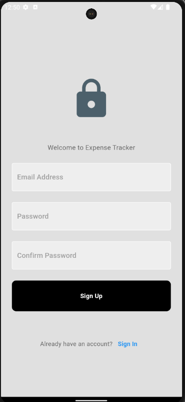
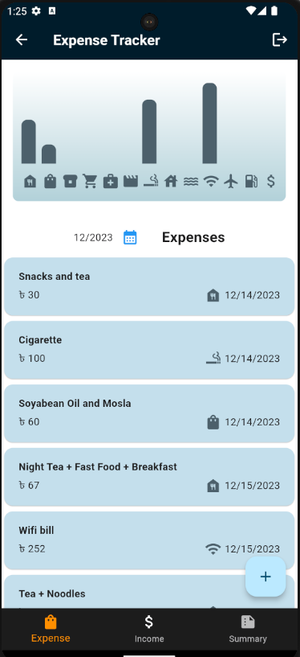
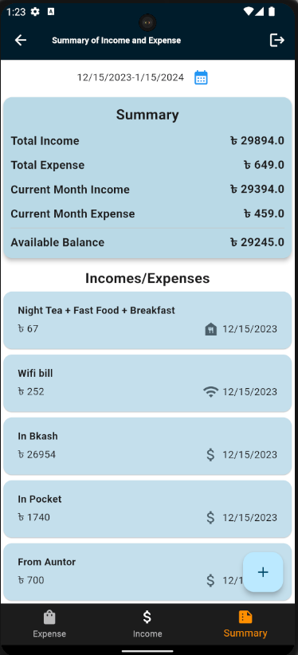

# Expense Tracker

## Description

This is a simple expense tracker app built with React and Firebase. It allows users to add, edit, and delete expenses. It also allows users to filter expenses by month.

## Sample Images

* Login Page

* Signup Page

* Expense Page

* Add Expense/Income Page

* Summary and Income Page


## How to run
* Creating a flutter project
```bash
mkdir expense
cd expense
flutter create .
replace lib folder with the lib folder in the repository
replace pubspec.yaml with the pubspec.yaml in the repository
flutter pub get
flutter emulators --launch <emulator name> eg. flutter emulators --launch Pixel_3a_API_30_x86
flutter run
```
* Server Side
   - Clone the api repository from [API](https://github.com/mrmezan06/api)
   - Set the environment variables in .env file
     - PORT
     - MONGODB_URI
     - DB_NAME
     - NODE_ENV = development
     - JWT_SECRET
     - JWT_EXPIRE
* Run the server
```bash
npm install
npm run dev
```
* Client Side
   - Set the BASE_URL  of all pages to your server url exa. http://localhost:5000/api/v1

## Features
* User can signup and login
* User can add and delete expenses
* User can add and delete income
* User can change the month to view total expenses and total income
* User can view the summary of the month
* User can logout

## Technologies Used
* Node.js
* Express.js
* MongoDB
* Bcryptjs
* Dart
* Flutter


## Softwares Used
* Visual Studio Code / Android Studio
* Postman [API Testing]
* MongoDB Compass [Database GUI]
* Android Emulator
* Git / Github [Version Control]

## Author
* [Mejanur Rahaman](https://github.com/mrmezan06)

## License
[MIT](#)


